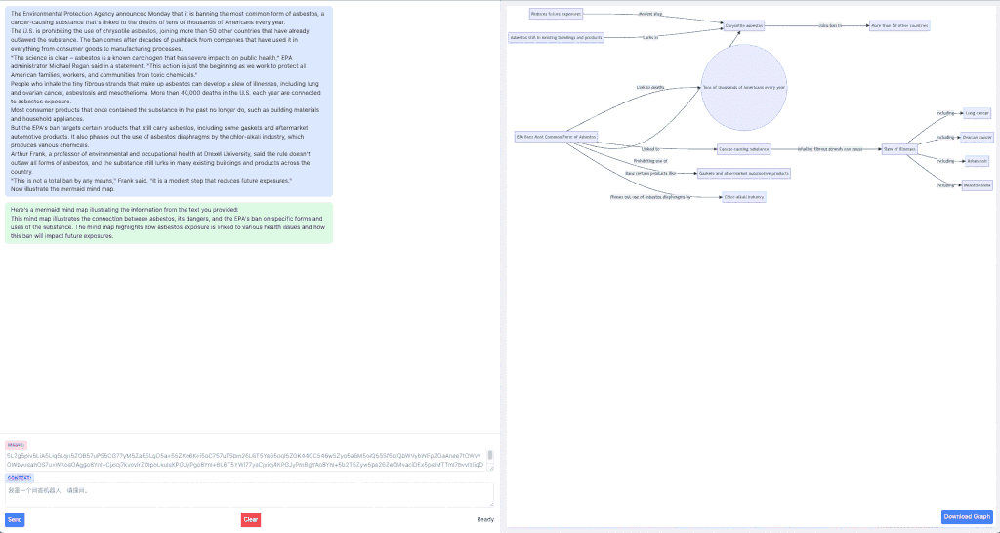
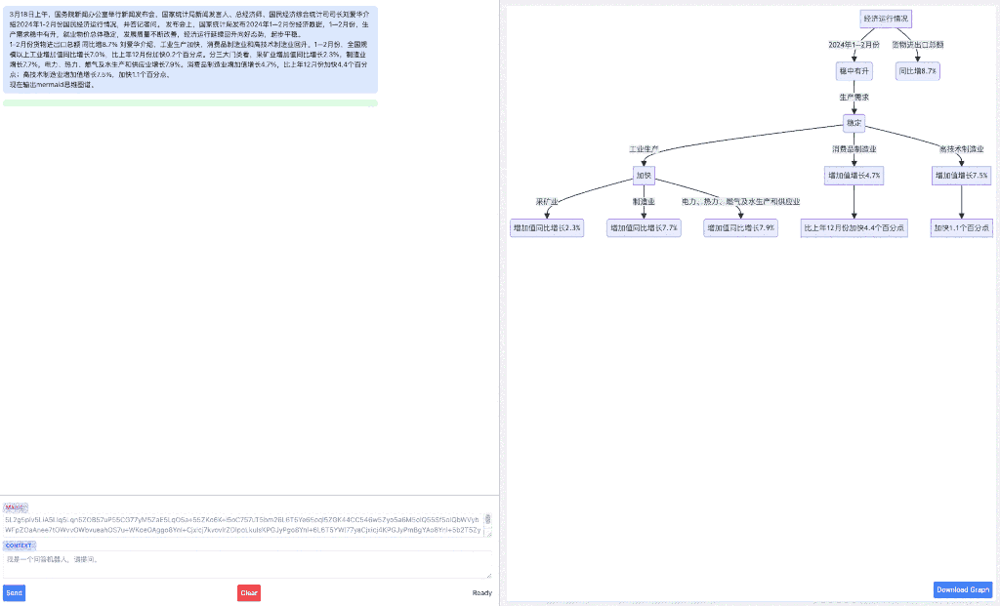
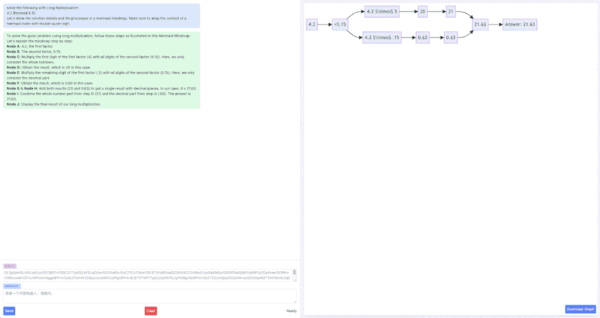
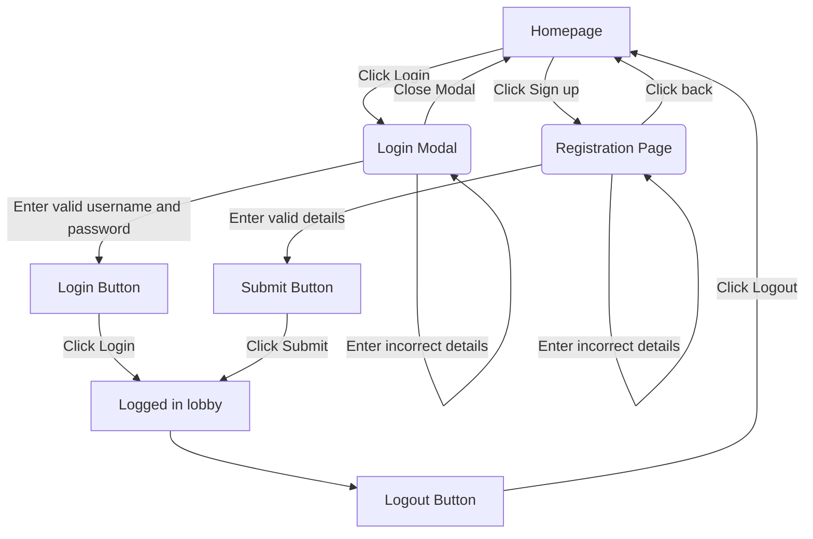
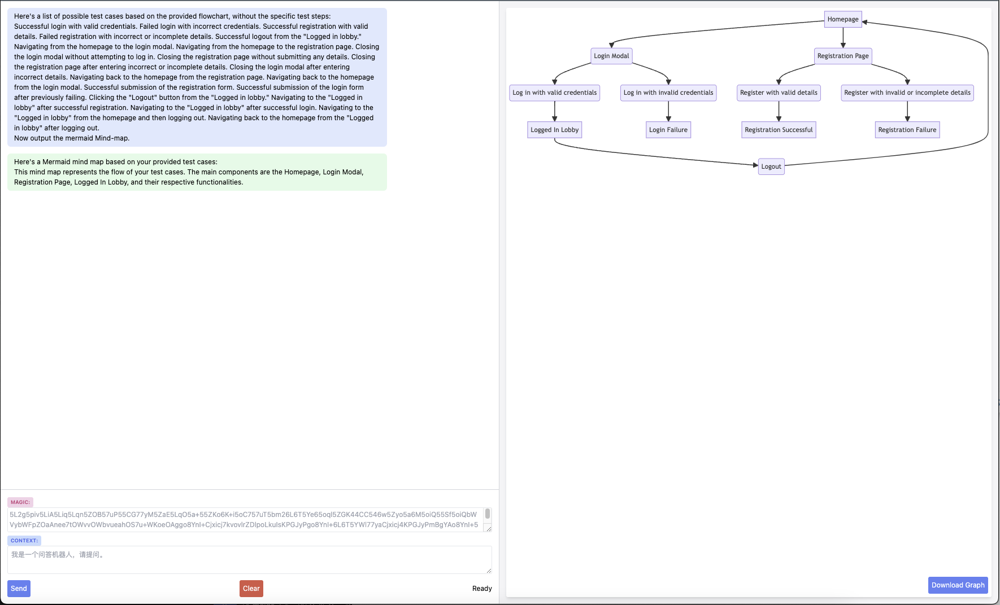
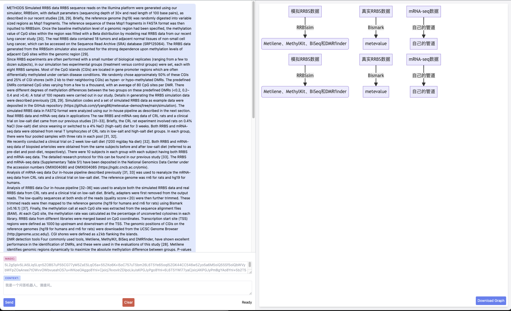
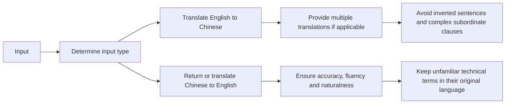
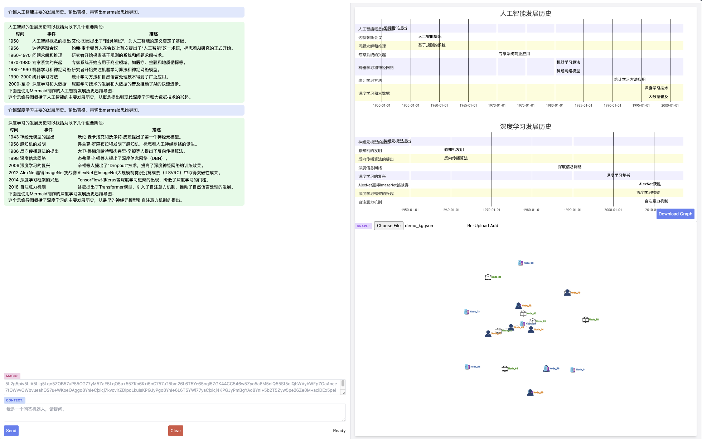

# Introduction


## Motivation

ToDo

The mermaid official plugin is [Mermaid-Plugin](https://docs.mermaidchart.com/plugins/chatgpt). Alternatively, this project uses a naive method and RAG to generate the flowchart.

## Design

ToDo


[source file](./prd/runit.drawio).

## Illustration

1. English News


2. Chinese News


3. Math Formular



## The prompt used

ToDo

## Example: Test Case generation and management

Gary Parker provided an intrestring example: [medium](https://medium.com/@qa.gary.parker/using-mermaid-chatgpt-for-test-case-generation-and-management-18ed07e99a37).

Here is the example:



The tested context is:

```
Here's a list of possible test cases based on the provided flowchart, without the specific test steps:

Successful login with valid credentials.
Failed login with incorrect credentials.
Successful registration with valid details.
Failed registration with incorrect or incomplete details.
Successful logout from the "Logged in lobby."
Navigating from the homepage to the login modal.
Navigating from the homepage to the registration page.
Closing the login modal without attempting to log in.
Closing the registration page without submitting any details.
Closing the registration page after entering incorrect or incomplete details.
Closing the login modal after entering incorrect details.
Navigating back to the homepage from the registration page.
Navigating back to the homepage from the login modal.
Successful submission of the registration form.
Successful submission of the login form after previously failing.
Clicking the "Logout" button from the "Logged in lobby."
Navigating to the "Logged in lobby" after successful registration.
Navigating to the "Logged in lobby" after successful login.
Navigating to the "Logged in lobby" from the homepage and then logging out.
Navigating back to the homepage from the "Logged in lobby" after logging out.
```

Now input it into `Doc2Chart`:



## Example: Academia Study

Summarize and translate the academia paper into a mermaid map. 



This manuscript could be found [here](https://academic.oup.com/bib/article/24/4/bbad241/7208695?login=false), or https://doi.org/10.1093/bib/bbad241. Basically, the mind-map summarizes our method in the BIB paper 😊😊😊

## Example: Prompt Planner-Translator

This example explains my "Chinese-English" prompts, and works well. The following section is the result generated by `Doc2Flow`.


### Results

I am a translator.

When the input is an English sentence, translate it into Chinese; when the input is a Chinese sentence, translate it into English. If only one word is given, provide multiple possible translations if applicable, otherwise don't include any extra words. Ensure the translation is accurate, fluent and follows common usage. Unfamiliar technical terms (especially nouns) should be left untranslated. Do not use inverted sentences or complex subordinate clauses.

Here's a summary of the process in Chinese:

中文翻译：
- 首先判断输入是英文还是中文，根据情况进行翻译或直接返回
- 如果输入是英文单词，提供多个可能的翻译结果
- 确保翻译准确、流畅且符合常用表达方式
- 对于未知的专业术语（尤其是名词），保留原文不要翻译
- 避免使用倒装句和复杂从句

The output table would look something like this:

| Step | Description |
| --- | --- |
| 1 | Determine if the input is English or Chinese and translate accordingly or return the input |
| 2 | If the input is an English word, provide multiple possible translations |
| 3 | Ensure translation accuracy, fluency, and naturalness |
| 4 | Avoid using inverted sentences and complex subordinate clauses |
| 5 | Keep unfamiliar technical terms in their original language |

Here's a mermaid diagram that illustrates the process:



## Example: Education, Timeline (Chinese)



# License

Apache License Version 2.0
